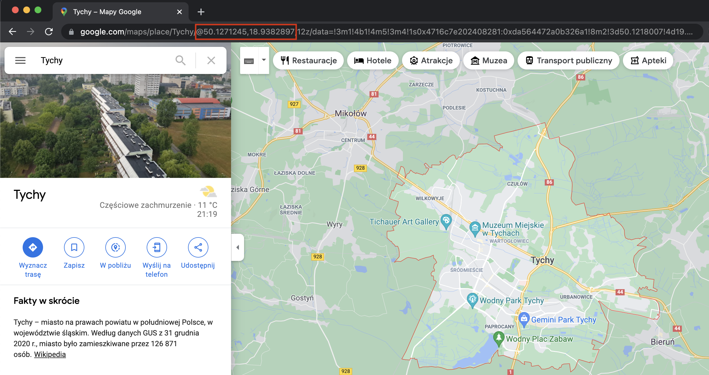
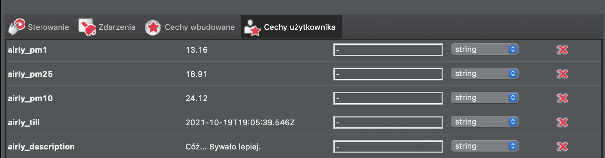
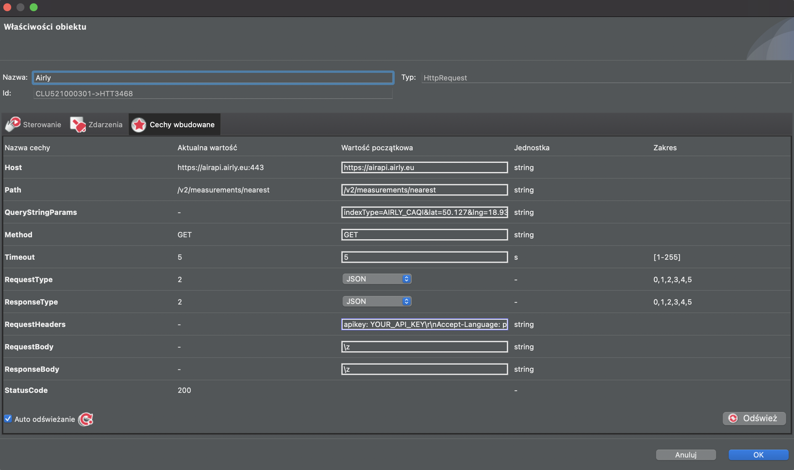
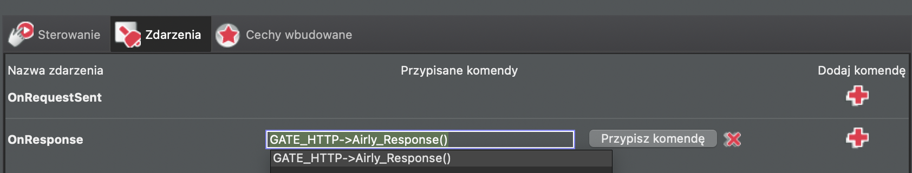
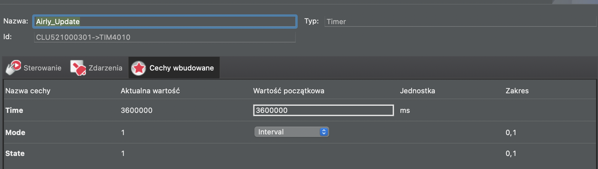
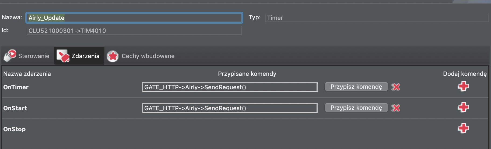

# air quality data
1. Create an account on https://developer.airly.org/
2. Get an API key
3. Find you coordinates, eg. using google maps you can find them by searching for an address and checking URL - https://www.google.com/maps/place/Tychy/@50.1271245,18.9382895,12z/data=!3m1!4b1!4m5!3m4!1s0x4716c7e202408281:0xda564472a0b326a1!8m2!3d50.1218007!4d19.0200023

Latitude: 50.127

Longitude: 18.938



4. In GateHTTP create following properties:
- airly_pm1
- airly_pm25
- airly_pm10
- airly_till
- airly_description



5. In GateHTTPreate a script `Airly_Response` to parse api response and store in http gate properties:
```
local resp = GATE_HTTP->Airly->ResponseBody

GATE_HTTP->airly_till = resp.current.tillDateTime
GATE_HTTP->airly_pm1 = resp.current.values[1].value
GATE_HTTP->airly_pm25 = resp.current.values[2].value
GATE_HTTP->airly_pm10 = resp.current.values[3].value
GATE_HTTP->airly_description = resp.current.indexes[1].description
```

6. In GateHTTP create HttpRequest object named `Airly` with following parameters:
- Host: `https://airapi.airly.eu`
- Path: `/v2/measurements/nearest`
- QueryStringParams: `indexType=AIRLY_CAQI&lat=50.127&lng=18.938&maxDistanceKM=3` with your own coordinates (lat/lng)
- Method: `GET`
- RequestType: `JSON`
- ResponseType: `JSON`
- RequestHeaders: `apikey: YOU_API_KEY\r\nAccept-Language: pl` and replace YOU_API_KEY with your own api airly key



7. Attach script as an event on response to update properties once we receive correct response from API


8. In GateHTTP create Timer object in order to update air condition properties on a regular basis. Here once per hour:




