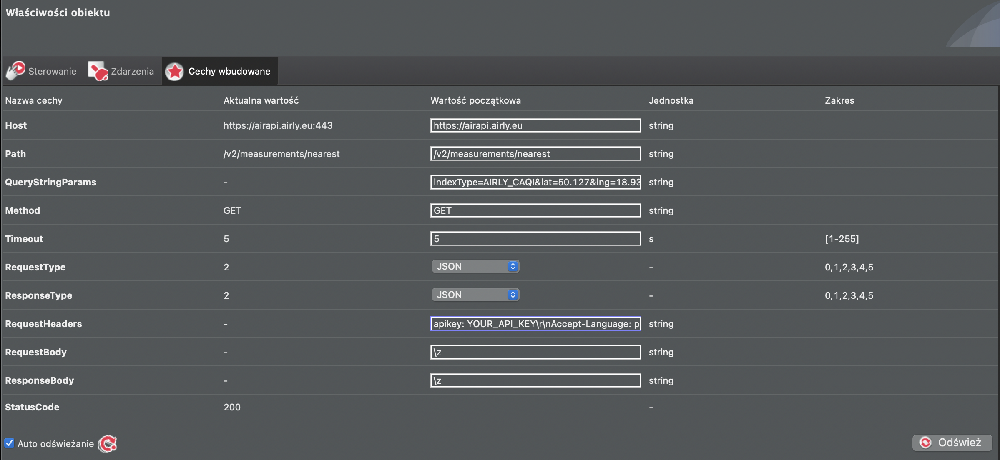

# air quality data
1. Create an account on https://developer.airly.org/
2. Get an API key
3. Find you coordinates, eg. using google maps you can find them by searching for an address and checking URL - https://www.google.com/maps/place/Tychy/@50.1271245,18.9382895,12z/data=!3m1!4b1!4m5!3m4!1s0x4716c7e202408281:0xda564472a0b326a1!8m2!3d50.1218007!4d19.0200023

Latitude: 50.127

Longitude: 18.938

4. In GateHTTP create HttpRequest object with following parameters:
- Host: `https://airapi.airly.eu`
- Path: `/v2/measurements/nearest`
- QueryStringParams: `indexType=AIRLY_CAQI&lat=50.127&lng=18.938&maxDistanceKM=3` with your own coordinates (lat/lng)
- Method: `GET`
- RequestType: `JSON`
- ResponseType: `JSON`
- RequestHeaders: `apikey: YOU_API_KEY\r\nAccept-Language: pl` and replace YOU_API_KEY with your own api airly key

5. In GateHTTP create Timer object:
- properties:

