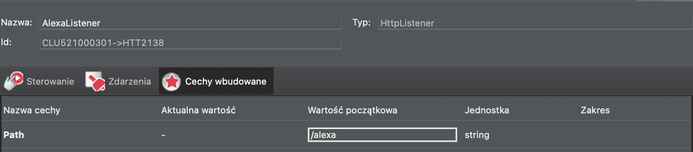
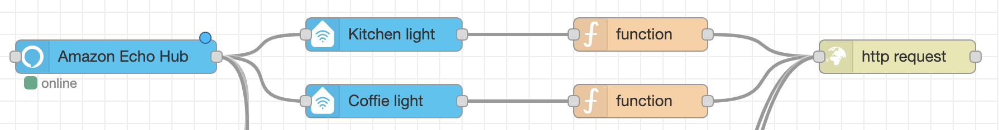
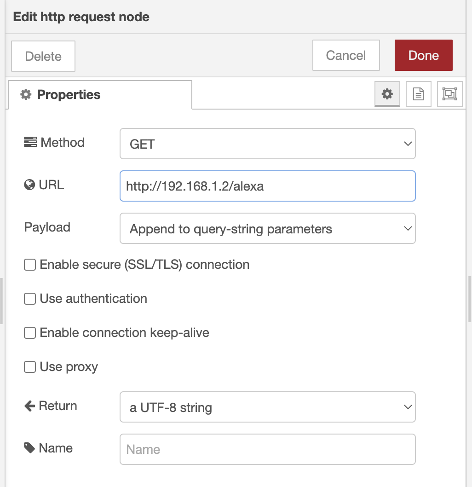

# alexa integration
1. install node-red on respberry pi https://nodered.org/docs/getting-started/raspberrypi
2. in node-red install `node-red-contrib-amazon-echo` https://flows.nodered.org/node/node-red-contrib-amazon-echo
3. Create following script in grenton GATE_HTTP
```
local qsp = GATE_HTTP->Alexa_Listener->QueryStringParams
local qspState = qsp.state
local qspId = qsp.id
local value = 0
GATE_HTTP->Alexa_Listener->SendResponse()
if (qsp.state == "on") then
	value = 1
else 
	value = 0
end
if (qspId == "kitchen") then
	CLU->Kitchen_Lights->SetValue(value)
end
if (qspId == "coffee") then
	CLU->Coffee_Lights->SetValue(value)
end
```
4. in grenton create `HttpListener` with following properties
- Path: `/alexa`



and then add event OnRequest and assigne above script to it
5. In node red create following flow


- first item is always echo hub
- second items are echo devices where the name will be used as command entry point
- next item is a function with payload to the grenton, eg. :
```
var newMsg = { payload: {id: 'kitchen', state: msg.payload} };
return newMsg;
```
- last item is http request object with following configuration
Method: 'GET'
URL: grenton gate http address, eg. http://192.168.1.2/alexa
Payload: Append to query-string parameters


6. Now ask "Alexa, discover devices" or start the discover procedure
7. After discovery you can say "Alexa, turn on kitchen lights"
