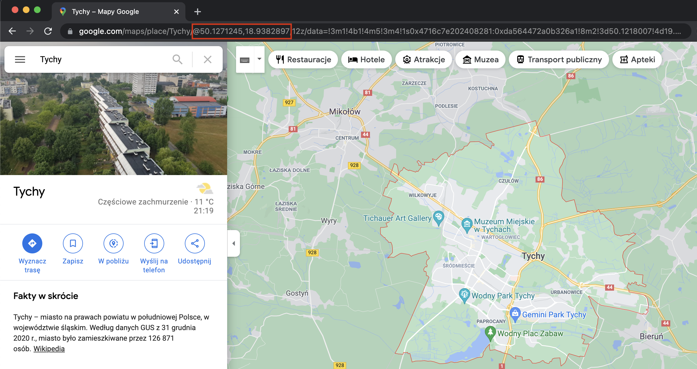
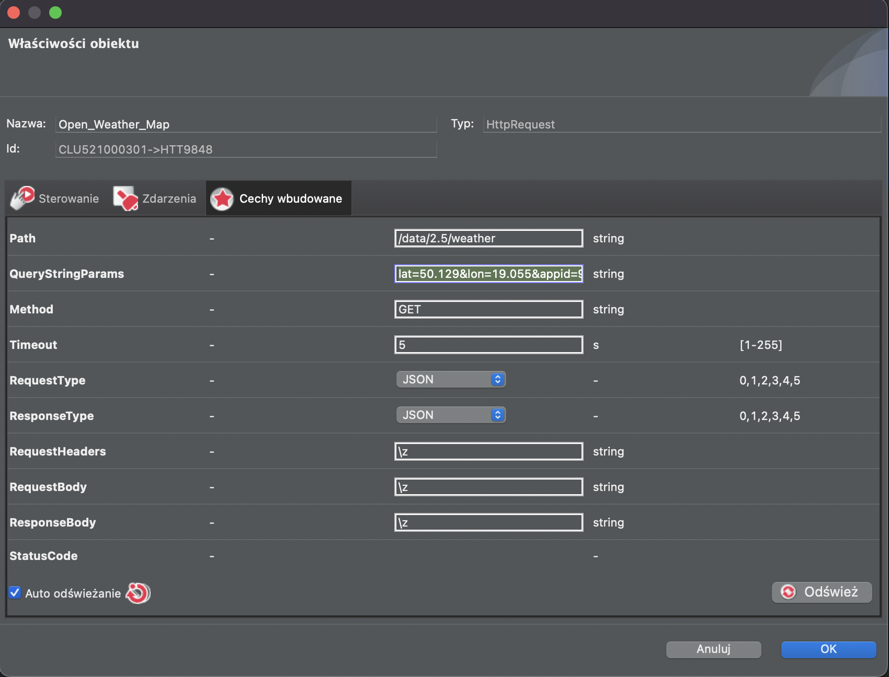
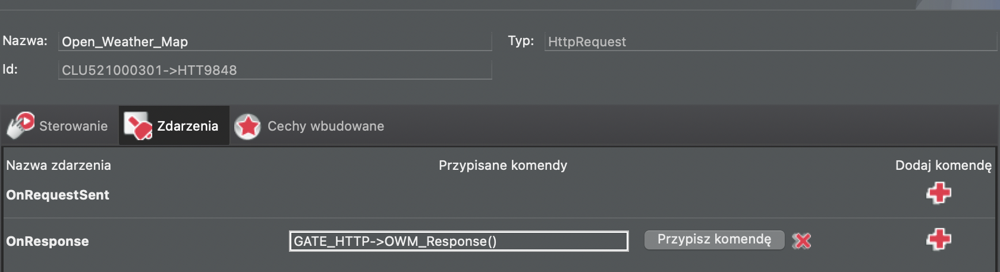
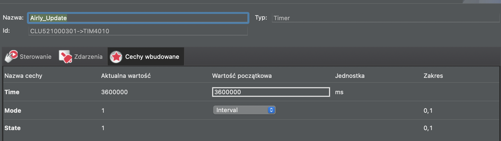
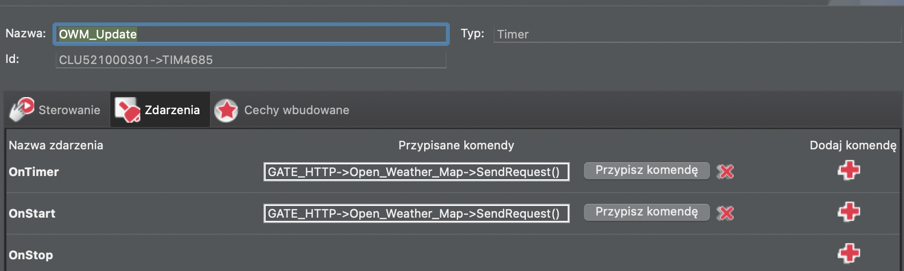

# open weather map data
1. Create an account on https://openweathermap.org
2. Go to API Keys and create one
3. Find you coordinates, eg. using google maps you can find them by searching for an address and checking URL - https://www.google.com/maps/place/Tychy/@50.1271245,18.9382895,12z/data=!3m1!4b1!4m5!3m4!1s0x4716c7e202408281:0xda564472a0b326a1!8m2!3d50.1218007!4d19.0200023

Latitude: 50.127

Longitude: 18.938



4. In GateHTTP create following properties:
- owm_temp_feels_like
- owm_description
- owm_wind
- owm_sunrise
- owm_sunset
- owm_timezone

5. In GateHTTPreate a script `OWP_Response` to parse api response and store in http gate properties:
```
local resp = GATE_HTTP->Open_Weather_Map->ResponseBody

GATE_HTTP->owm_temp_feels_like = resp.main.feels_like
GATE_HTTP->owm_wind = resp.wind.speed
GATE_HTTP->owm_description = resp.weather[1].description
GATE_HTTP->owm_sunrise = resp.sys.sunrise
GATE_HTTP->owm_sunset = resp.sys.sunset
GATE_HTTP->owm_timezone = resp.timezone
```

6. In GateHTTP create HttpRequest object named `Open_Weather_Map` with following parameters:
- Host: `https://api.openweathermap.org`
- Path: `/data/2.5/weather`
- QueryStringParams: `lat=50.129&lon=19.055&appid=API_KEY&units=metric&lang=pl` with your own coordinates (lat/lng) and your API_KEY
- Method: `GET`
- RequestType: `JSON`
- ResponseType: `JSON`



7. Attach script as an event on response to update properties once we receive correct response from API


8. In GateHTTP create Timer object in order to update open weather map properties on a regular basis. Here once per hour:



