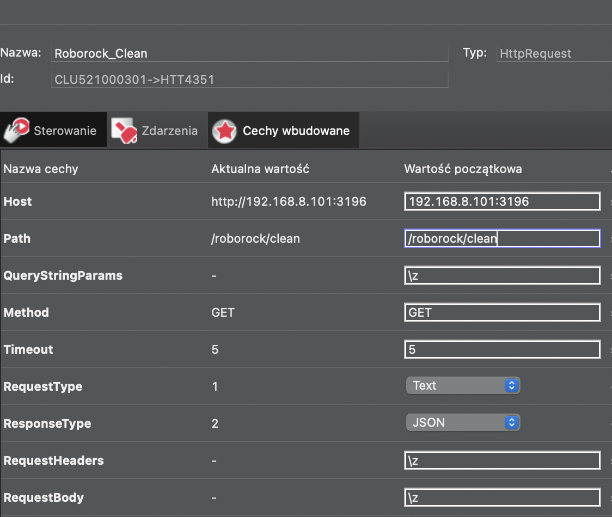

# roborock integration
1. Get roborock token and local ip address - use https://github.com/widmofazowe/Xiaomi-cloud-tokens-extractor
2. Create NodeJS server (eg. on raspberri pi) with the code from the repository
3. run `cp .env.example .env`
4. fill variables in .env file: ROBOROCK_IP and ROBOROCK_TOKEN
5. run `npm install`
6. run `npm start`
7. test integration by going to http://localhost:4000/roborock/batteryLevel
8. Cleaning can be started by going to http://localhost:4000/roborock/clean
9. In GateHTTP create HttpRequest object named `Roborock_Clean` with following parameters:
- Host: IP address of a server created from point 2
- Path: `/roborock/clean`
- Method: `GET`
- RequestType: `JSON`
- ResponseType: `JSON`

10. You can use script `GATE_HTTP->Roborock_Clean->SendRequest()`